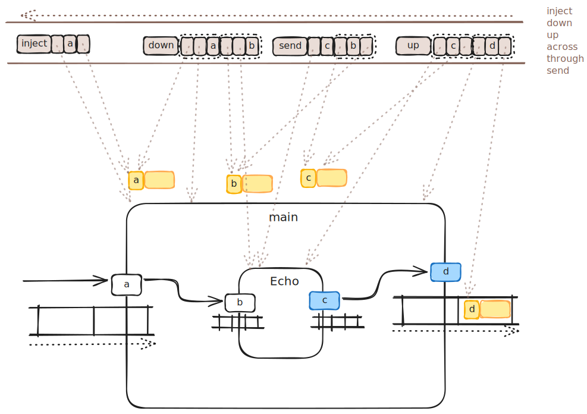

- components have 1 input queue
- components have 1 output queue
- components have 1 name (the name of their template (like Class)) (names can be the null string, names can contain whitespace)
- components have 0 or more named input ports (names can be the null string, names can contain whitespace)
- components have 0 or more named output ports (names can be the null string, names can contain whitespace)
- messages are 2-tuples
  1. port name
  2. data
- Container components, also contain several more pieces of information
  - 1. a list of children components (children are included by composition)
  - 2. a list template routing 3-tuples {direction, sender, receiver}
    - where direction is one of [down | up | across | through]
	- where sender is a 2-tuple {component template name, port name}
	- where receiver is a 2-tuple {component template name, port name}
  - 3. a queue of dynamic routings {action, sender, receiver}, recorded at runtime in order
	- where action is one of [inject | send | down | up | across | through]
	- where sender is a 2-tuple {component, port name}
	- where receiver is a 2-tuple {component, port name}
    - N.B. an "inject" routing has no "sender" record - the "injected" message comes from outside of the 0D environment
  
 - port and gates
   - input and output ports denote inputs and outputs of components when viewed from outside
   - input and output gates denote inputs and outputs of Container components when viewed from the inside
   - for example, 
	 - currently we draw one diagram for each Container
	 - the diagram shows the children of the Container as rounded rectangles
	 - the diagram shows template routings between the children as arrows
     - the input gates and output gates of Containers are drawn as rhombuses
	 - input and output ports of children components inside each Container, are drawn as "pills" (short rectangles with large rounding radii)

- templates vs. instances

- conventions
  - the main (sometimes only) input of each component is given a null string as its name (akin to `stdin` in C, but with a null name)
  - the main (sometimes only) output of each component is given a null string as its name (akin to `stdout` in C, but with a null name)
  - the main (sometimes only) error output of each component is given a name consisting of a single-character string containing the Unicode letter `✗` (akin to `stderr` in C)
  - important routing paths are drawn as black arrows, 2 pixels wide, rounded edges, 100% opacity
  - unimportant routing paths are drawn as black arrows, 1 pixel wide, rounded edges, 30% opacity
  - unimportant ports and gates are given 30% opacity for the figure and for the contained text

- for development (& debug & iterative design)
  - messages persist, so that they may be referred to by the dynamic routing descriptors
  - dynamic routings persist, so that they may displayed akin to backtraces (one backtrace for each Container instance, a "tree" of backtraces for the complete system)
  - trace_routings (container) ... is used to return a string representation of all routings in a Container's routings queue
  
- Optimization
  - as is, the above structures are not optimized and include information that can be inferred
  - for example, Messages contain port (and gate) names, and, routing descriptor contain the same information
  
